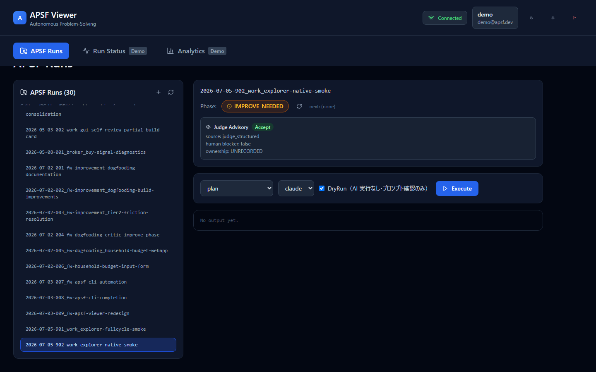

# APSF Explorer

**A phase-gated, human-in-the-loop GUI for AI problem-solving workflows.**

APSF Explorer implements the APSF (AI Problem Solving Framework) workflow —
**fully self-contained** (Node.js only; no Python, no external framework
install required):

```
Goal → Plan → Build → Review → Improve → Result
```

AI agents (Planner / Builder / Critic) execute the auto-owned phases via real
CLI tools (Claude Code, Codex CLI). **Human-owned phases are structurally
enforced** — the auto-loop always stops at judgment points (`IMPROVE_NEEDED`,
`RESULT_NEEDED`, ...) and hands control back to you. Every phase produces an
auditable Markdown artifact with guarded state transitions.



## Why

Most AI agent tools optimize for full autonomy. APSF Explorer optimizes for
**governed autonomy**:

- 🛑 **Human gates are not optional** — the loop cannot skip your judgment
- 📄 **Every phase is an artifact** — goal.md / plan.md / build.md / review.md
  are reviewable, diffable, and survive the session
- 🔀 **Provider-agnostic** — switch between `claude` and `codex` CLIs; they use
  their own session auth (no API keys to manage)
- 🧭 **Deterministic phase detection** — run state is derived from files +
  `run_state.json` with a validated transition table

### Does the quality gate actually work? A true story

During v0.2.0 verification we ran a full cycle entirely on `codex`. The task
asked for a file with a specific Japanese heading. The **Builder** (codex)
wrote it — but with an English heading, and it also touched a file outside
the declared scope. The **Critic** (also codex, same model, read-only sandbox)
reviewed the build against the goal and flagged both deviations as Critical:

> "`codex_smoke.md` does not contain the requested heading […] the build also
> reports changing `build.md`, which conflicts with the goal's explicit scope
> constraint." — recommendation: **Return to Build**

The loop then stopped at `IMPROVE_NEEDED` and handed the final call to the
human Judge. No prompt trickery, no second model — just role separation with
independent context. The same model that made the mistake caught the mistake,
and the framework made sure a human decided what to do about it. That's the
entire thesis of this project, demonstrated by accident.

## Architecture

```
React 18 + TS (Vite) ── /api, /ws ──► Node/Express + WebSocket
                                          │
                              ExecutionModeRouter
                              ├─ cli-full   claude -p (tools on, artifacts saved)
                              ├─ cli-lite   claude -p (read-only tools, ephemeral)
                              ├─ apsf-run   NativeApsfExecutor (all-TypeScript)
                              └─ api        (planned)                 │
                                                       runs/<name>/ *.md + run_state.json
```

The `apsf-run` mode is a **complete TypeScript implementation** of the APSF
workflow engine (`backend/src/services/apsf-native/`): run creation from
templates, file-heuristic + canonical phase detection, prompt assembly with
keyword-scored specialist selection, guarded phase persistence (overwrite
protection, validated state transitions, judge advisory extraction), and the
human-gated auto-loop. Specialist definitions and run templates ship in
`backend/content/`.

It was ported from the original Python APSF framework and verified against it
with a **51-point parity suite** — phase detection across every real run,
byte-identical run scaffolding, identical prompts (up to 46 KB, specialist
selection included), and matching state transitions / advisory records. If you
have an existing APSF framework checkout, point `APSF_ROOT` at it and Explorer
uses its runs/, templates, and specialists; otherwise any directory with an
empty `runs/` folder works.

> ⚠️ Writes to `runs/` should go through Explorer only. Mixing writes from the
> Python `apsf` CLI and Explorer against the same workspace risks state drift.

## Getting started

Prerequisites: Node 20+, and at least one AI CLI on PATH
([Claude Code](https://claude.com/claude-code) and/or Codex CLI). That's all —
no Python required.

```bash
# 1. Install
npm install
cd backend && npm install && cd ..

# 2. Configure backend
cp backend/.env.example backend/.env
mkdir -p ~/apsf-workspace/runs          # any directory with runs/ works
# set APSF_ROOT=~/apsf-workspace in backend/.env

# 3. Run (two terminals)
cd backend && npm run dev               # backend :3001
npm run dev                             # frontend :5173
```

Open http://localhost:5173 — sign in with any email/password (demo auth).
From the **APSF Runs** tab you can:

- **Create a run** (`+` button) — light runs start at `TASK_NEEDED`
- **Write human phases in the browser** — task.md / improve.md / result.md are
  saved with overwrite protection and validated state transitions
- **Execute AI phases** — plan / build / review / full-cycle, with a
  **DryRun** toggle to preview the assembled prompt without spending tokens
- **See the Judge advisory** — `judge_advisory.json` is surfaced when the loop
  stops at `IMPROVE_NEEDED`

## Testing

All test suites exercise real implementation code — real processes, real
WebSocket events, real browser rendering. No mocks, no stubs.

```bash
cd backend && npx tsx run-integration-tests.ts     # real backend, 32 tests
cd backend && npx tsx run-cli-integration-tests.ts # real CLI detection + invocation
cd backend && npx tsx run-apsf-standalone-test.ts  # empty workspace, no python on PATH
cd backend && npx tsx run-apsf-parity-test.ts      # TS vs original Python (51 checks)
npx tsx scripts/run-frontend-integration-tests.ts  # real WS protocol
npm run test:e2e                                   # Playwright: login → create → write

# Opt-in (spends tokens): real AI end-to-end
RUN_REAL_CLI=1 npx tsx backend/run-cli-integration-tests.ts
```

## Security notes

- Demo auth accepts any credentials and issues real JWTs — **do not expose
  this to the internet as-is**. Production requires `JWT_SECRET` (the server
  refuses to start without it).
- BUILD phases run the AI CLI with file-write tools enabled
  (`APSF_PERMISSION_MODE`, default `acceptEdits`). Run in a workspace you
  trust the agent to edit.
- API keys in the backend environment are deliberately stripped before
  spawning AI CLIs — session auth is the intended path.

## Status

Working alpha. The full loop (real AI executing BUILD → REVIEW, stopping at
the human judgment gate) is verified end-to-end, and the human side of the
loop (run creation, phase writing) works from the browser.

## License

[MIT](LICENSE)
